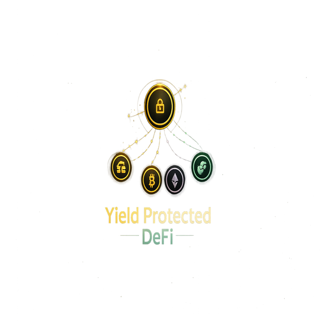
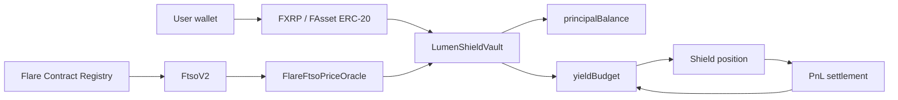

<p align="center">
  
</p>

<h1 align="center">LumenShield</h1>

<p align="center">
  Principal-protected FXRP and FAsset vaults on Flare.
</p>

<p align="center">
  <a href="https://github.com/CodeswithrohStudio/lumenshield"></a>
  
  
  
  
</p>

<p align="center">
  <a href="#live-coston2-deployment">Contracts</a>
  ·
  <a href="#quickstart">Quickstart</a>
  ·
  <a href="#verification">Verification</a>
  ·
  <a href="docs/EVIDENCE.md">Evidence</a>
  ·
  <a href="docs/COSTON2_DEPLOYMENT.md">Deployment Runbook</a>
</p>

## Overview

LumenShield is a Flare-native port of the Yoldr product concept. It lets users keep FXRP/FAsset principal isolated in vault accounting while only earned yield can be used as risk capital for higher-upside shield positions.

The hackathon focus is **Flare Summer Signal, Bounty 1: Interoperable Asset Products**. The build uses Coston2, FXRP/FAssets, Flare Contract Registry, and FTSOv2. Flare Confidential Compute is documented as a future private risk-scoring extension, not claimed in the current build.

## Table Of Contents

- [Overview](#overview)
- [Live Coston2 Deployment](#live-coston2-deployment)
- [What It Does](#what-it-does)
- [Flare Integration](#flare-integration)
- [Architecture](#architecture)
- [Quickstart](#quickstart)
- [Environment](#environment)
- [Verification](#verification)
- [Repository Structure](#repository-structure)
- [Submission Boundaries](#submission-boundaries)
- [Roadmap](#roadmap)
- [License](#license)

## Live Coston2 Deployment

| Item | Value |
| --- | --- |
| Network | Flare Testnet Coston2 |
| Chain ID | `114` |
| RPC | `https://coston2-api.flare.network/ext/C/rpc` |
| Explorer | `https://coston2-explorer.flare.network` |
| FXRP asset | [`0x0b6A3645c240605887a5532109323A3E12273dc7`](https://coston2-explorer.flare.network/address/0x0b6A3645c240605887a5532109323A3E12273dc7) |
| LumenShield vault | [`0x41365634247e7E8CE4d5109057c6356b52930479`](https://coston2-explorer.flare.network/address/0x41365634247e7E8CE4d5109057c6356b52930479) |
| FTSO adapter | [`0x46930F19B28921cee5b608a6571b65D36502B925`](https://coston2-explorer.flare.network/address/0x46930F19B28921cee5b608a6571b65D36502B925) |
| Owner | `0xE20D41E77bF1d2121E4bc50411e4523300b72B9a` |

### Deployment Transactions

| Transaction | Hash |
| --- | --- |
| Oracle deploy | [`0x672fba6004a5e3e9af0589bf91cd9bf5cb534694694984d7354f694f0963d715`](https://coston2-explorer.flare.network/tx/0x672fba6004a5e3e9af0589bf91cd9bf5cb534694694984d7354f694f0963d715) |
| Vault deploy | [`0x93c8f99a45de1d91195dad5995b09584f9bc063a899c8925f17b456ac232bd3f`](https://coston2-explorer.flare.network/tx/0x93c8f99a45de1d91195dad5995b09584f9bc063a899c8925f17b456ac232bd3f) |
| Vault oracle config | [`0x731470c4203de2a0b7f319765f65511de3f36ecc95a4e3b983074c9b8183cc0d`](https://coston2-explorer.flare.network/tx/0x731470c4203de2a0b7f319765f65511de3f36ecc95a4e3b983074c9b8183cc0d) |

### Smoke Checks

```text
cast chain-id -> 114
owner() -> 0xE20D41E77bF1d2121E4bc50411e4523300b72B9a
asset() -> 0x0b6A3645c240605887a5532109323A3E12273dc7
priceOracle() -> 0x46930F19B28921cee5b608a6571b65D36502B925
maxPriceAge() -> 180
nextShieldId() -> 1
latestPrice(XRP/USD) -> 1010592, 6, 1786671693
```

## What It Does

Most DeFi products ask users to accept principal risk before they can access upside. LumenShield separates capital into two lanes:

- **Principal lane:** user FXRP/FAsset principal is custodied by the vault and tracked as `principalBalance`.
- **Yield lane:** earned yield is tracked as `yieldBudget` and is the only budget allowed into shield positions.

If a shield wins, yield budget grows. If a shield loses, the loss settles against the yield stake and cannot touch principal accounting.

## Flare Integration

| Flare surface | How LumenShield uses it |
| --- | --- |
| Coston2 | Deployed vault and FTSO adapter on chain ID `114`. |
| FAssets / FXRP | Vault is configured for the documented Coston2 FXRP ERC-20. |
| Flare Contract Registry | Adapter resolves `FtsoV2`; app resolves `AssetManagerFXRP` and `FtsoV2`. |
| FTSOv2 | Vault adapter reads XRP/USD entry price and rejects stale prices. |
| FDC | Roadmap boundary for future external payment or proof flows. |
| FCC | Roadmap boundary for future private risk-profile scoring. |

The dashboard performs live read-only Coston2 calls for `AssetManagerFXRP`, the FXRP token, FXRP lot size, `FtsoV2`, XRP/USD, and the deployed LumenShield vault.

## Architecture



Core contracts:

- [`contracts/LumenShieldVault.sol`](contracts/LumenShieldVault.sol): FXRP/FAsset vault, principal/yield separation, shield accounting, stale-price gate.
- [`contracts/FlareFtsoPriceOracle.sol`](contracts/FlareFtsoPriceOracle.sol): Flare Contract Registry to FTSOv2 adapter.
- [`script/DeployLumenShieldVault.s.sol`](script/DeployLumenShieldVault.s.sol): broadcast-ready Coston2 deploy script.
- [`test/LumenShieldVault.t.sol`](test/LumenShieldVault.t.sol): Foundry tests for accounting and FTSO entry behavior.

## Quickstart

```bash
git clone https://github.com/CodeswithrohStudio/lumenshield.git
cd lumenshield
npm install
npm run dev
```

Open the app at:

```text
http://localhost:3000
```

Run the verification suite:

```bash
forge test
npm run lint
npm run build
```

## Environment

Public Coston2 values are included in [`.env.example`](.env.example):

```bash
NEXT_PUBLIC_FLARE_NETWORK=Coston2
NEXT_PUBLIC_FLARE_CHAIN_ID=114
NEXT_PUBLIC_FLARE_RPC_URL=https://coston2-api.flare.network/ext/C/rpc
NEXT_PUBLIC_FLARE_EXPLORER_URL=https://coston2-explorer.flare.network
NEXT_PUBLIC_FLARE_CONTRACT_REGISTRY=0xaD67FE66660Fb8dFE9d6b1b4240d8650e30F6019
NEXT_PUBLIC_COSTON2_FXRP_ADDRESS=0x0b6A3645c240605887a5532109323A3E12273dc7
NEXT_PUBLIC_LUMENSHIELD_VAULT_ADDRESS=0x41365634247e7E8CE4d5109057c6356b52930479
NEXT_PUBLIC_LUMENSHIELD_ORACLE_ADDRESS=0x46930F19B28921cee5b608a6571b65D36502B925
```

Never commit private keys, seed phrases, funded wallet files, `.env.local`, Foundry cache artifacts, or raw broadcast secrets.

## Verification

Latest local verification:

| Check | Result |
| --- | --- |
| `forge test` | 7 passed, 0 failed |
| `npm run lint` | clean |
| `npm run build` | successful |
| Live Coston2 read | AssetManagerFXRP, FXRP, lot size, FtsoV2, XRP/USD, vault owner, vault asset, vault oracle |

Foundry test coverage includes:

- FXRP-style ERC-20 principal deposits.
- Funded yield credits in the same asset.
- Explicitly unfunded simulated-yield demo state.
- Shield opening from yield only.
- FTSO entry price recording.
- Stale price rejection.
- Principal withdrawal after a losing shield.

## Repository Structure

```text
contracts/
  FlareFtsoPriceOracle.sol
  LumenShieldVault.sol
script/
  DeployLumenShieldVault.s.sol
test/
  LumenShieldVault.t.sol
docs/
  CONTRACTS.md
  COSTON2_DEPLOYMENT.md
  EVIDENCE.md
  FCC_SCOPE.md
  PRODUCT_PLAN.md
  SUBMISSION_STRATEGY.md
src/
  app/
  components/
  lib/flare.ts
  lib/flareLive.ts
public/
  og-image.png
  logo.png
  lumenshield-mark.svg
```

## Submission Boundaries

LumenShield does not claim:

- risk-free yield
- audited contracts
- Flare mainnet readiness
- production yield generation
- live FDC attestation verification
- live Flare Confidential Compute support
- guaranteed protection against oracle, bridge, market, adapter, or smart contract risk

The current claim is specific: LumenShield is a Coston2-deployed FXRP/FAsset vault prototype with live FAssets and FTSOv2 reads, principal/yield separation tests, and documented future FDC/FCC paths.

## Roadmap

- Add wallet-driven deposit and withdraw flows against the deployed Coston2 vault.
- Add optional FXRP test deposit walkthrough with a disposable wallet.
- Add FDC-backed proof flow for external asset/payment state.
- Add FCC-backed private risk scoring for shield eligibility.
- Add hosted demo URL and walkthrough video for final submission.

## License

MIT
